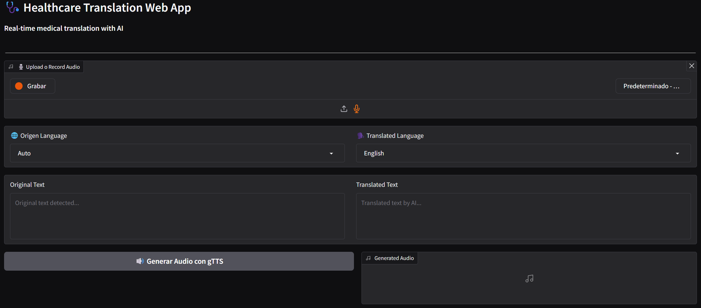

# Receipt Information Extraction

## Description:
This project helps communication between patients and healthcare professionals who speak different languages. It uses a web app that integrates open-source AI models for speech transcription, translation, and voice synthesis.  
No external APIs are used, focusing on privacy, sustainability, and reproducibility.

## Table of Contents
- [Environment](#environment)
- [Components](#components)
- [Procedure](#procedure)
- [Results](#results)
- [Conclusions](#conclusions)

## Environment
- Hugging Face Spaces was chosen because it offers free hosting. It is a temporary solution for the problem we want to solve.
- The environment is free but limited. It runs on CPU.
- You can see the demo at: [HealthcareTranslation on Hugging Face Spaces](https://huggingface.co/spaces/JamesKevinStar/HealthcareTranslation)

## Components 
The project uses different models and libraries to work properly:
  - **Whisper**: Used to get the text from the user's audio.
  - **Llama 3.2 Instruct**: Used to translate the text and detect the original language.
  - **gTTS**: Used to generate audio from the translated text. By default, it uses an English accent.
  - **Gradio**: Used to build the user interface. It works on both web and mobile.
 
## Procedure

### 1. Voice Input. 
- The user can upload an audio file or record using a microphone.
- The audio is saved in `.wav` format and sent to the processing modules.

### 2. Text Extraction.
- The audio is processed using Whisper, which returns the spoken text with high accuracy.
- The extracted text is sent to the next modules for translation and voice generation.

### 3. Translation and Language Detection.
- The text is sent to the Llama 3.2 Instruct model with a specific role and instruction.
- The model returns the translated text and also detects the original language.
- Both tasks use the Hugging Face API.

### 4. Voice Generation 
- The translated text is sent to the module that converts it into audio using gTTS.

## Results
- A functional prototype was successfully created.
- Generative AI models were used for the main tasks.
- A user interface was built to show how the system works.

## Conclusions
- The app runs on CPU, which limits performance. Using GPU would give better results.
- The app takes time at the beginning because Whisper processes the audio locally, without an API.
- If an API was used for transcription, the process would be faster and the output quality would improve.
- In the part where text is converted to audio, a generative AI model was not used because it took too long to produce the output. That’s why other methods were chosen instead.

